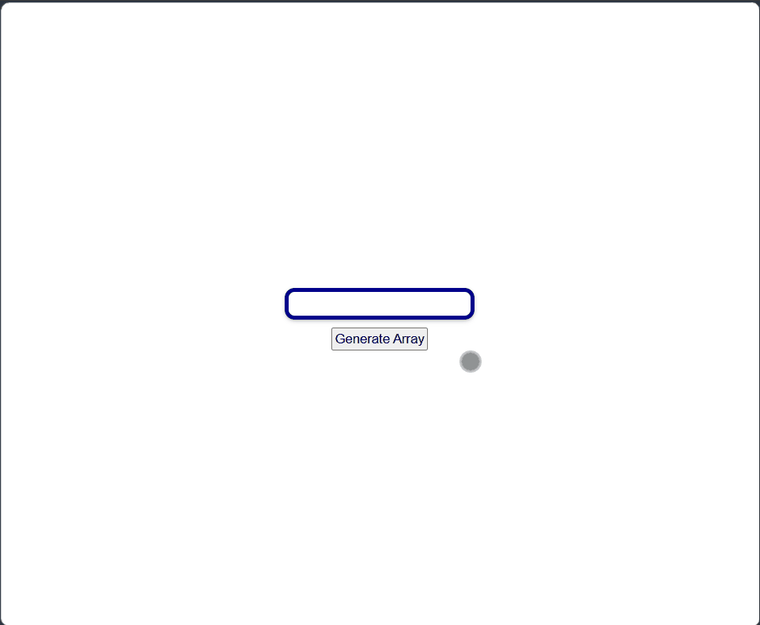

# Sorting Visualizer

An interactive JavaScript app that visually demonstrates how sorting algorithms work. This project showcases functional programming, algorithmic thinking, DOM manipulation, and responsive UI design.

---

## 🚀 Live Demo

[View Project](https://himanshu-kumar-2301.github.io/fcc-js-sorting-visualizer/)

---

## 🛠️ Tech Stack

- HTML5
- CSS3
- JavaScript (ES6+)

---

## 📸 Screenshots



---

## 📚 Features

- **Functional programming approach**: Implements sorting logic using pure functions and immutability.
- **Interactive UI**: Users can generate arrays of random numbers and watch the sorting process step‑by‑step.
- **Adjustable speed**: Control the visualization speed for better understanding.
- **Responsive design**: Works seamlessly across desktop and mobile browsers.

---

## 📂 Project Structure

```code
root/  
|--index.html  
|--style.css  
|--script.js  
└--assets/  
     └--images/  
```

---

## 🧑‍💻 How to Run Locally

1. Clone the repo:

    ```bash
    git clone https://github.com/Himanshu-Kumar-2301/fcc-js-sorting-visualizer.git
    ```

2. Navigate into the folder

    ```bash
    cd fcc-js-sorting-visualizer
    ```

3. Open ```index.html``` in your browser.

## 📌 Future Improvements

- Add more algorithms (Heap Sort, Radix Sort).
- Provide step‑by‑step explanations alongside the visualization.
- Add color coding for comparisons and swaps.
- Enhance accessibility with ARIA labels and keyboard navigation.

## ℹ️ About

This project is part of the **FreeCodeCamp JavaScript curriculum** and highlights skills in **functional programming, algorithm visualization, and interactive UI design**. It serves as a practical example of applying programming concepts to improve algorithm understanding.
